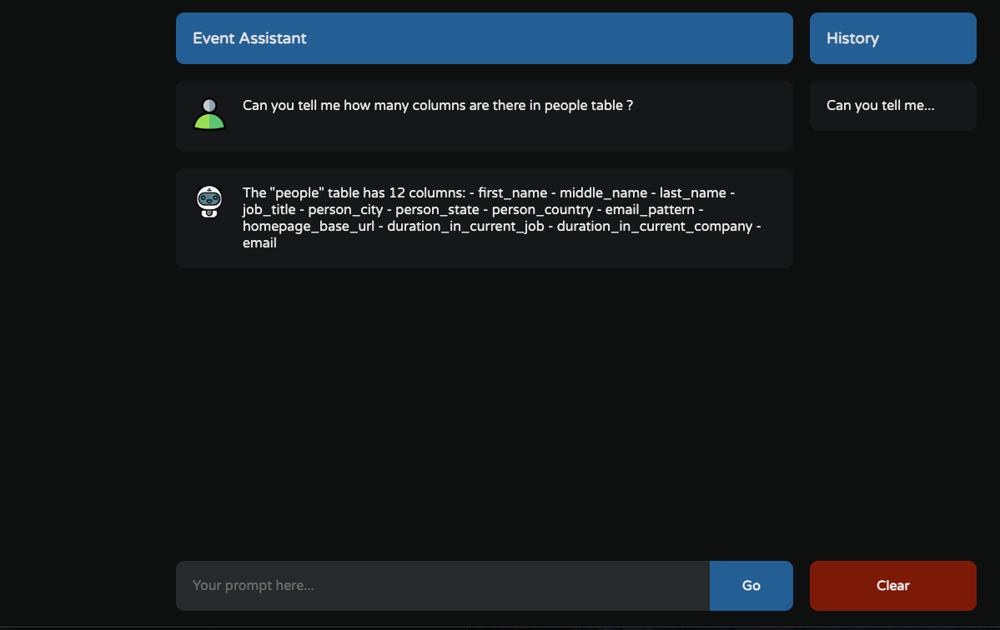

# Setup
1. Clone the repo ``` git clone https://github.com/AyRawat/byte-genie-client.git```
2. Go inside the folder ``` cd byte-gnie-client ```
3. run ``` npm i ```
4. run ``` npm run dev ```

The app will start at ```localhost:5173```


# UI Functionality
1. Lets you type the Query in Natural Language.
2. Shows not only the current response but also the old reponses.
3. A History Section.Can go to the old query that you have asked previously.
4. Cannot hit a request multiple times, if a query is already processing.
5. Manages its own state.
6. Responsive page.
7. A loader to indicate that request is processing.


# API 

### Route
``` METHOD:[POST] 127.0.0.1:5000/api/query ```
### Request
```
curl --location '127.0.0.1:5000/api/query' \
--header 'Content-Type: application/json' \
--data-raw '{"question":"Can you tell me how many people are working in sales department ?","history":[{"role":"user","content":"Can you list me the email of 5 people ?"},{"role":"assistant","content":"The email addresses of 5 people are:\n1. cynthia.battini@ariane.group\n2. alexander.mcclure@amazon.com\n3. nadir.shaari@artefact.com\n4. daniela.bonvino@dilmahtea.com\n5. nkushwa@digitalrealty.com"},{"role":"user","content":"Can you tell me how many people are working in sales department ?"}]}'
```

### Response
```
{
  "response": "There are 1155 people working in the sales department."
}
```


# Problems Faced
1. Layout related.

# Improvements
1. Caching can definitely be a good addition, to save some requests.
2. A section for viewing Past queries, like really old queries. 
3. Login Mechanism, so that the platform can be accessed only by Authorized personnel.
